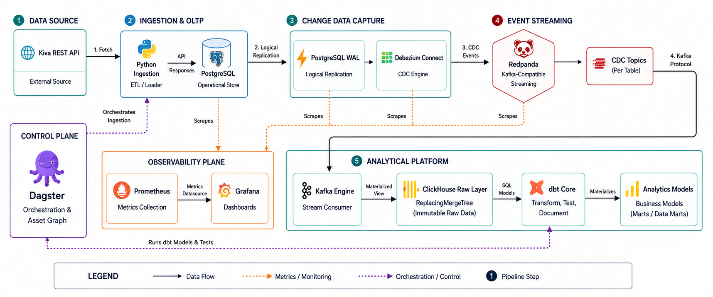

# Kiva Microfinance Data Platform

## Architecture Overview
This repository contains a production-grade, end-to-end data analytics platform for Kiva's public loan data. 

The architecture simulates a modern, resilient, and highly scalable data stack capable of handling real-time streaming and massive analytical workloads, while being extremely conscious of hardware resource limitations.

### The Stack:
1. **Ingestion (Source):** Python REST API Ingestion into **PostgreSQL** (OLTP).
2. **Change Data Capture (CDC):** **Debezium** tracking logical replication slots in Postgres, auto-registered at startup by a `connector-registrar` init container.
3. **Event Stream:** **Redpanda** (A lightweight, C++ Kafka alternative requiring zero JVM overhead).
4. **Data Warehouse (OLAP):** **ClickHouse**, utilizing native Kafka-engine ingestion to sink messages instantly without a dedicated connector service.
5. **Transformation & Data Quality:** **dbt (Data Build Tool)** executing SQL transformations and data quality tests directly inside ClickHouse, docs served live via **dbt-docs**.
6. **Orchestration:** **Dagster** orchestrating the entire lineage from API fetch -> CDC Buffer -> dbt Run -> dbt Test.
7. **Observability:** **Prometheus & Grafana**, scraping Redpanda, ClickHouse, Postgres (`postgres-exporter`), and a custom **`cdc-monitor`** exporter that reconciles Postgres/ClickHouse row counts and measures real CDC replication lag — plus 4 provisioned Grafana alert rules.

### Architecture Flow


The diagram above shows the core data path. See [`docs/design-report.md`](./docs/design-report.md) for the full current-state architecture diagram (including the observability/reliability additions), the ERD/schema documentation with ClickHouse design rationale, and the scaling plan.

---

## Design Decisions

* **Redpanda over Kafka:** Kafka requires Zookeeper (or KRaft) and a massive JVM memory footprint. Redpanda is a C++ Kafka-compatible binary that runs in a fraction of the memory, avoiding local machine crashes during testing.
* **ClickHouse over Postgres for Analytics:** Postgres is excellent for OLTP, but ClickHouse is a columnar analytical engine capable of processing billions of rows per second. By separating OLTP and OLAP, the architecture guarantees production stability.
* **ClickHouse `FINAL` modifier for CDC:** Instead of complex SQL deduplication logic, the dbt staging model leverages ClickHouse's `ReplacingMergeTree` and `FINAL` modifier to instantly collapse CDC event history into the absolute latest state.
* **Dagster over Airflow (For Local Development):** Airflow relies on a webserver, scheduler, and worker (often requiring multiple gigabytes of RAM). I moved to Dagster solely to run this project efficiently on limited local hardware. However, for an enterprise-grade orchestrator in a production environment, I would definitely go with **Apache Airflow**.
* **Docker Compose Healthchecks & Network Isolation:** Every container implements strict health checks and startup sequencing, mitigating race conditions during localized deployment.
* **Auto-Registered CDC Connector:** The Debezium connector config is a template rendered from `.env` credentials and POSTed automatically by a one-shot `connector-registrar` container that waits on Debezium's healthcheck. This is what makes `docker compose up -d` alone sufficient — no manual `curl` step.
* **Reconciliation over inference:** Rather than assuming CDC "just works" because Redpanda/ClickHouse report healthy, `cdc-monitor` (`src/cdc_monitor.py`) directly compares Postgres and ClickHouse row counts and measures freshness lag using Postgres's own `updated_at` timestamp carried through the pipeline — a stalled or lossy connector is caught even when every infrastructure metric looks fine.

## Future Scalability
If deploying this to an Enterprise Cloud environment (e.g., GCP or AWS) at massive scale, the architecture would evolve to ensure maximum resilience and throughput:
1. **Enterprise Orchestration with Airflow:** While Dagster was used locally to bypass hardware constraints, I would absolutely migrate to **Apache Airflow** for the enterprise-grade orchestrator. Its distributed executors and massive community ecosystem make it the undisputed choice for scaling production pipelines.
2. **Replacing Redpanda with Apache Kafka:** Redpanda was utilized for this local setup to bypass JVM constraints, but considering the overload and stability requirements of a true production environment, I will use **Apache Kafka** in place of Redpanda. Kafka remains the battle-tested, enterprise standard for streaming data at immense scale.
3. **dbt Fusion (Rust Engine):** Upgrading the transformation layer from the legacy Python-based `dbt-core` to the new Rust-based **dbt Fusion** execution engine. This would massively reduce DAG compilation times and memory overhead for projects with thousands of models.

---

## Dataset & Domain Overview
This platform ingests and processes live micro-finance loan data fetched directly from the **Kiva Public REST API** (`https://api.kivaws.org/v1/loans/search.json`).

**Authentication:** none required. Kiva's `/v1/loans/search.json` endpoint is fully public and read-only — no API key, token, or account registration is needed. The only special handling required is a standard browser `User-Agent` header (see `src/ingest_api.py`), since Kiva's WAF blocks requests carrying the default Python `requests` signature.

### Why Kiva Data?
Kiva is a global micro-lending platform that provides loan capital to entrepreneurs and small business owners in developing regions. This domain was chosen because Kiva's public API provides a useful real-world dataset for demonstrating CDC, data modeling, and analytics.

### Schema & Core Attributes:
The pipeline ingests real-time transactional loan records with the following schema:
* `id` (BigInt): Unique loan identifier (Primary Key for CDC deduplication).
* `name` (String): Name of the entrepreneur or borrowing group.
* `status` (String): Current loan funding state (e.g., `funded`).
* `funded_amount` (Float64/Decimal): Capital raised for the loan.
* `loan_amount` (Float64/Decimal): Total capital requested by the entrepreneur.
* `activity` (String): Specific micro-business activity (e.g., *Farming*, *Retail*, *Tailoring*).
* `sector` (String): Industry sector (e.g., *Agriculture*, *Services*, *Food*).
* `country` & `town` (String): Geographical region of the borrower.
* `posted_date` (Timestamp): Timestamp when the loan was published on the platform.

---

## How to Run Locally

### Prerequisites
* Docker & Docker Compose (v2, i.e. the `docker compose` CLI, not `docker-compose`)
* Git
* ~4 GB of free RAM for the container set

### 1. Spin up the entire stack — one command
```bash
cp .env.example .env   # optional: only needed if you want to override defaults
docker compose up -d
```
This single command starts **everything**: Postgres, Redpanda, Debezium, the `connector-registrar`, ClickHouse, `dbt-docs`, Dagster, `cdc-monitor`, `postgres-exporter`, Prometheus, Grafana, Redpanda Console, and the Debezium UI.

Give it 30–60 seconds on first boot for image pulls and healthchecks. Confirm everything is up:
```bash
docker compose ps
```
All services should show `healthy` or `running`. If you ever need to re-register the connector manually (e.g. after editing `config/debezium_postgres_source.json.template`):
```bash
docker compose up connector-registrar
```

### 2. Run the Orchestration Pipeline (Dagster)
Open your browser and navigate to **[http://localhost:3000](http://localhost:3000)**.
1. Click on **Assets** in the top navigation bar.
2. Click **Materialize All** to run the full pipeline.

**What happens under the hood?**
1. Dagster executes the Python script to fetch real Kiva Loan data and upserts it into Postgres.
2. Debezium captures the inserts/updates and streams them as JSON into Redpanda.
3. ClickHouse consumes the Redpanda stream instantly into `raw_data.kiva_loans_raw`.
4. Dagster runs `dbt run` to materialize the models in ClickHouse.
5. Dagster runs `dbt test` to enforce data quality constraints (Unique IDs, Non-Null values, Accepted Statuses).

It also runs unattended on a daily schedule (`0 0 * * *`, defined in `dagster_orchestration/definitions.py`) once the Dagster container is up.

---

## Validating the Pipeline

Check each stage independently, in order:

**1. Ingestion landed in Postgres:**
```bash
docker exec -it kiva_postgres psql -U kiva_admin -d kiva_oltp \
  -c "SELECT COUNT(*), MAX(updated_at) FROM raw_data.kiva_loans;"
```

**2. CDC events reached the Redpanda topic:**
```bash
docker exec -it kiva_redpanda rpk topic consume cdc.raw_data.kiva_loans --num 3
```
or browse visually via **Redpanda Console** at [http://localhost:8080](http://localhost:8080).

**3. Debezium connector is healthy:**
```bash
curl -s http://localhost:8083/connectors/kiva-postgres-connector/status | python -m json.tool
```
or via **Debezium UI** at [http://localhost:8084](http://localhost:8084).

**4. Data landed in ClickHouse (raw CDC table):**
```bash
docker exec -it kiva_clickhouse clickhouse-client \
  --query "SELECT COUNT(*) FROM raw_data.kiva_loans_raw FINAL WHERE is_deleted = 0"
```

**5. dbt models built successfully (staging → marts):**
```bash
docker exec -it kiva_clickhouse clickhouse-client \
  --query "SELECT COUNT(*) FROM analytics.mart_loans_by_sector"
docker exec -it kiva_clickhouse clickhouse-client \
  --query "SELECT COUNT(*) FROM analytics.mart_loan_features_ml"
```
Or browse the generated docs/lineage graph at **dbt-docs**: [http://localhost:8085](http://localhost:8085).

**6. End-to-end CDC integrity (no dropped/stale rows):**
```bash
curl -s http://localhost:9200/metrics | grep -E "cdc_row_count_drift|cdc_replication_lag_seconds"
```
`cdc_row_count_drift` should trend toward `0` and `cdc_replication_lag_seconds` should stay low (single-digit to low-double-digit seconds) once the pipeline is idle. Both are also plotted live on the **Kiva Microfinance Pipeline Observability** Grafana dashboard.

---

## Accessing the Platform

| Service | URL | Credentials |
|---|---|---|
| Dagster (orchestration UI) | http://localhost:3000 | — |
| Grafana (dashboards + alerts) | http://localhost:3001 | `admin` / `kiva` (see `.env`) |
| Prometheus (raw metrics/targets) | http://localhost:9090 | — |
| dbt-docs (lineage graph & catalog) | http://localhost:8085 | — |
| Redpanda Console (topics/messages) | http://localhost:8080 | — |
| Debezium UI (connector status) | http://localhost:8084 | — |
| `cdc-monitor` raw metrics | http://localhost:9200/metrics | — |
| Mailpit (captured alert emails) | http://localhost:8025 | — |
| PostgreSQL (OLTP) | `localhost:5433` | `kiva_admin` / `kiva_password`, db `kiva_oltp` (see `.env`) |
| ClickHouse HTTP interface | http://localhost:8123 | `kiva_admin` / `kiva_password` |
| ClickHouse native TCP (for `clickhouse-client`) | `localhost:9000` | `kiva_admin` / `kiva_password` |
| Debezium Kafka Connect REST API | http://localhost:8083 | — |

All default credentials live in [`.env.example`](./.env.example) — copy it to `.env` to override them.

---

## Observability & Business Dashboards
* **Grafana Dashboards:** http://localhost:3001 (`admin` / `kiva`)
  - **Kiva Microfinance Pipeline Observability:** operational metrics — Redpanda throughput, ClickHouse memory/queries/write ops, Postgres-vs-ClickHouse row reconciliation, CDC replication lag, Debezium connector state, Postgres exporter status.
  - **Kiva Microfinance Executive Loan Analytics:** business intelligence & ML feature distributions querying the ClickHouse marts directly.
* **Grafana Alerting:** http://localhost:3001/alerting/list — 4 provisioned rules (CDC row drift, CDC replication lag, Debezium connector down, ClickHouse ingestion stalled), routed by a provisioned notification policy to a real email contact point. See [`docs/observability.md`](./docs/observability.md) for the full design and rationale.
* **Alert emails:** captured by **Mailpit** at http://localhost:8025 (a local SMTP catcher — no real credentials needed to see alerting work end-to-end). To manually trigger one: `docker stop kiva_debezium`, wait ~2-3 minutes for the `debezium-connector-down` rule to fire, check the email at localhost:8025, then `docker start kiva_debezium` to resolve it. See [`docs/observability.md`](./docs/observability.md#3-alerting) for the full walkthrough, including how to point this at a real mailbox instead.
* **Prometheus Targets:** http://localhost:9090/targets — `redpanda`, `clickhouse`, `postgres-exporter`, `cdc-monitor`.

---

## CI/CD

Defined in [`.github/workflows/ci.yml`](./.github/workflows/ci.yml), triggered on every push/PR to `main`/`master`. Three staged jobs — each gated on the previous one passing, so cheap/fast feedback happens before the expensive full-stack test runs:

1. **Lint & Unit Test** — `flake8` (fails the build on syntax errors/undefined names; warns on style) + `pytest tests/` (ingestion logic and CDC-monitor drift/lag/connector-health calculations, all mocked — no live services required).
2. **Docker Compose & dbt Validation** — `docker compose config` (catches YAML/interpolation errors) + `dbt parse` (catches dbt syntax/ref errors) as a fast smoke test.
3. **End-to-End CDC + dbt Integration Test** — actually stands up Postgres, Redpanda, Debezium, ClickHouse, `cdc-monitor`, and `postgres-exporter`; auto-registers the Debezium connector; runs the real ingestion script against the live stack; polls ClickHouse until CDC-replicated rows are observed; runs `dbt run` and `dbt test` against the live warehouse; and checks that `cdc-monitor`'s `/metrics` endpoint is reporting real values. This is what catches a connector config or model that's syntactically valid but functionally broken — the previous version of this pipeline only ran `dbt parse`, which cannot catch that class of bug.
